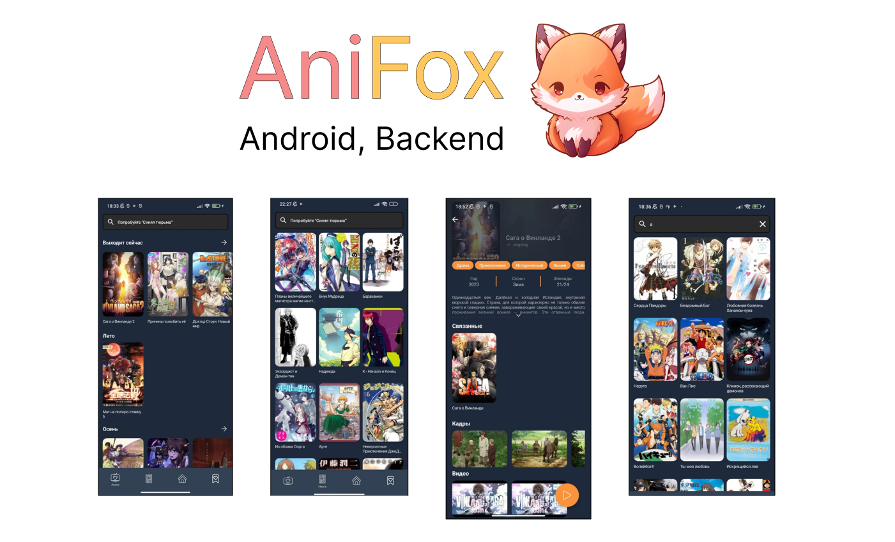

**AniFox** is a kotlin multiplatform anime project where people can watch anime. `**Open source project**`

## About
The **AniFox** is a project that was created with passion. It all started when a young person wanted to create their own version of an anime application, as every app with anime viewing capabilities had a large amount of advertising. It ended up evolving into a [diploma](https://github.com/DeNyWho/AniFoxKMP/blob/master/%D0%92%D0%9A%D0%A0.pdf) project. This repository contains the final diploma kmp version. All the features of the new backend version part can be seen on the [website](https://anifox.su).  The Android part of the KMP project was developed using the MVVM and SOLID architecture.
## Features
- **Parser** -   using scheduled tasks in Spring Boot, new anime data from shikimori, jikan, kitsu, haglund, kodik are added to the PostgreSQL database every 12 hours
- **Update** - using scheduled tasks in Spring Boot, new anime episodes from kodik, and episodes info from kitsu and jikan are added to the PostgreSQL database every 1 hour
- Default anime requests: anime main catalog request, details, etc
- Default manga requests: manga main catalog request, details
- Oauth 2.0 authorization between Keycloak which installed on anifox server, and spring boot application ( works with cookie )
- Default user requests: add rating to anime, add anime to favourite lists ( watching, watched, in plan, postponed )
## Built With 🛠
***Android KMP:***
- [Kotlin](https://kotlinlang.org/) - is a modern but already mature programming language designed to make developers happier.
- [Jetpack Compose](https://developer.android.com/jetpack/compose) - is a modern toolkit for building native Android UI.
- [Ktor Client](https://ktor.io/docs/welcome.html) - is a library for writing the client-side of HTTP requests in the Ktor framework. 
- [Kotlin Coroutines](https://kotlinlang.org/docs/coroutines-overview.html) - simplify asynchronous programming in Kotlin, making it easier to write non-blocking code for improved application responsiveness.
- [Kotlin serialization](https://kotlinlang.org/docs/serialization.html) - is the process of converting data used by an application to a format that can be transferred over a network or stored in a database or a file.
- [Koin](https://insert-koin.io/) - the pragmatic Kotlin & Kotlin Multiplatform Dependency Injection framework
- [Datastore](https://developer.android.com/topic/libraries/architecture/datastore) - is a new **data** storage solution introduced by Google as part of the **Android** Jetpack library.

***Backend:***
- [Kotlin](https://kotlinlang.org/) - is a modern but already mature programming language designed to make developers happier.
- [Spring boot](https://spring.io/projects/spring-boot) - is a Java framework designed to simplify the configuration and deployment of applications, providing a streamlined development experience.
- [Ktor Client](https://ktor.io/docs/welcome.html) - is a library for writing the client-side of HTTP requests in the Ktor framework.
- [Kotlin Coroutines](https://kotlinlang.org/docs/coroutines-overview.html) - simplify asynchronous programming in Kotlin, making it easier to write non-blocking code for improved application responsiveness.
- [Kotlin serialization](https://kotlinlang.org/docs/serialization.html) - is the process of converting data used by an application to a format that can be transferred over a network or stored in a database or a file.
- [Springdoc](https://springdoc.org/) - java library helps to automate the generation of API documentation using spring boot projects.
- [Spring Data JPA](https://spring.io/projects/spring-data-jpa) - part of the larger Spring Data family, makes it easy to easily implement JPA-based (Java Persistence API) repositories.
- [Spring Boot and OAuth2](https://spring.io/guides/tutorials/spring-boot-oauth2/) - is a framework that provides seamless integration of OAuth 2.0 authentication and authorization mechanisms into Spring Boot applications, facilitating secure and standardized user authentication processes.
- [PostgreSQL](https://www.postgresql.org/) - is a powerful, open source object-relational database system with over 35 years of active development that has earned it a strong reputation for reliability, feature robustness, and performance.
- [Keycloak](https://www.keycloak.org/) - open source identity and access management.
- [Amazon S3](https://docs.amazonaws.cn/en_us/AmazonS3/latest/userguide/Welcome.html) - is an object storage service that offers industry-leading scalability, data availability, security, and performance.
- [Shikimori](https://shikimori.one/) - is an online platform dedicated to anime and manga enthusiasts, providing a community-driven database for information, reviews, and discussions about anime series and manga titles.
- [Jikan REST API v4](https://docs.api.jikan.moe/) - is an **Unofficial** MyAnimeList API. It scrapes the website to satisfy the need for a complete API - which MyAnimeList lacks.
- [Kitsu](https://kitsu.io/) -  is an online platform catering to anime and manga enthusiasts, offering a user-friendly database for discovering, tracking, and discussing anime series and manga titles.
- [Haglund](https://arm.haglund.dev/docs) -  a service for mapping Anime IDs.
- [Kodik](https://kodik.online/) -  is a convenient database for searching, tracking and discussing anime episodes, as well as information about anime.
- [Docker](https://www.docker.com/) -  is a platform designed to help developers build, share, and run container applications.
## License
This project uses the **Apache** license, the details are written [here](https://github.com/DeNyWho/Anifox_Backend/blob/main/LICENSE)

To contact me, use `denis.akhunov123@gmail.com`
